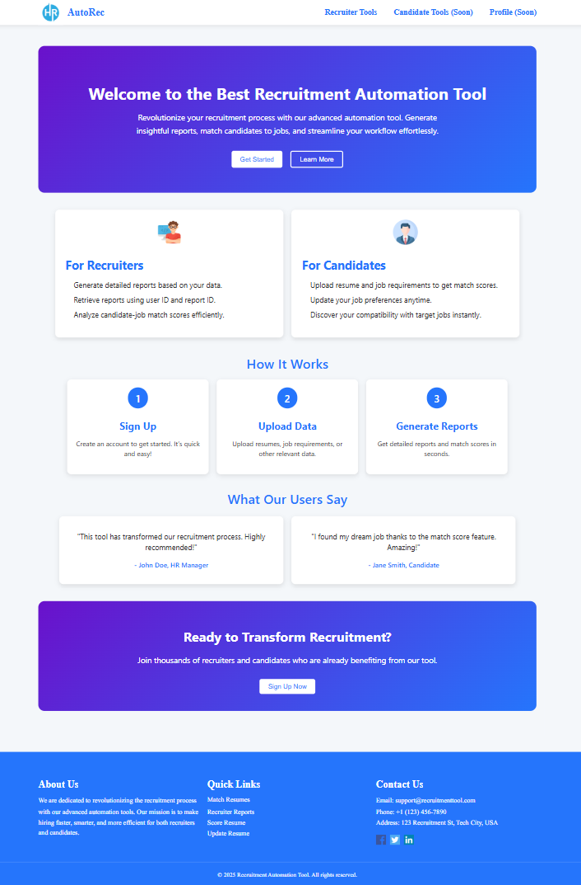
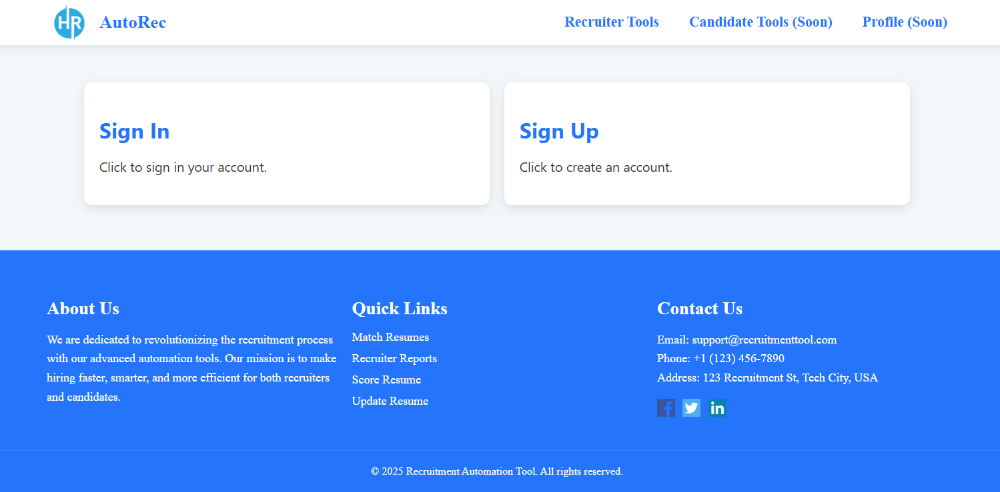
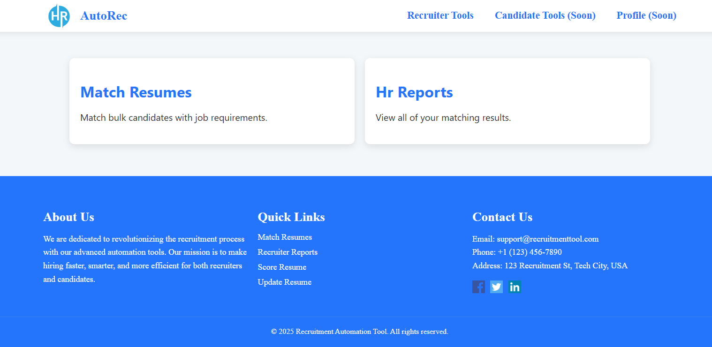
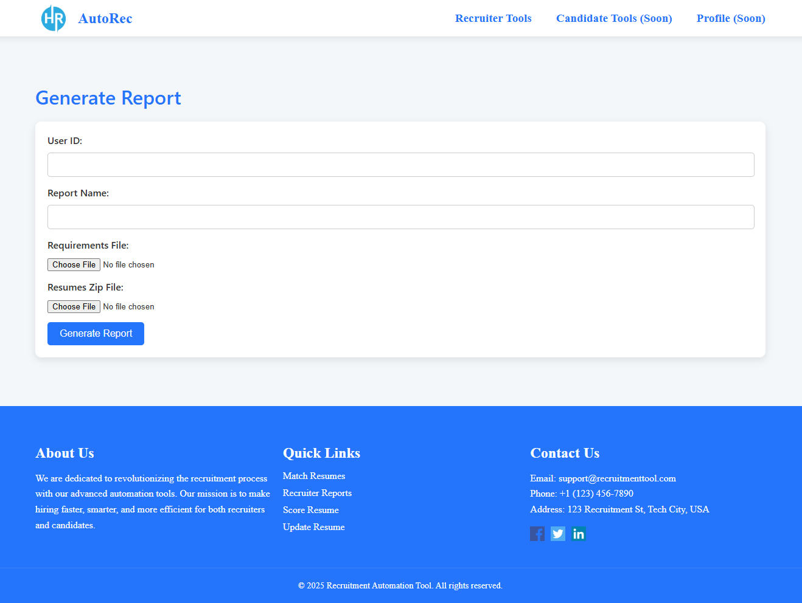
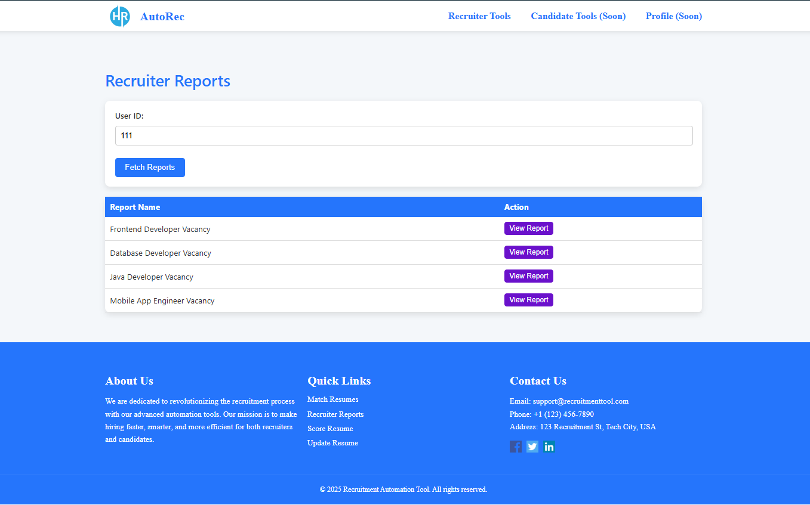
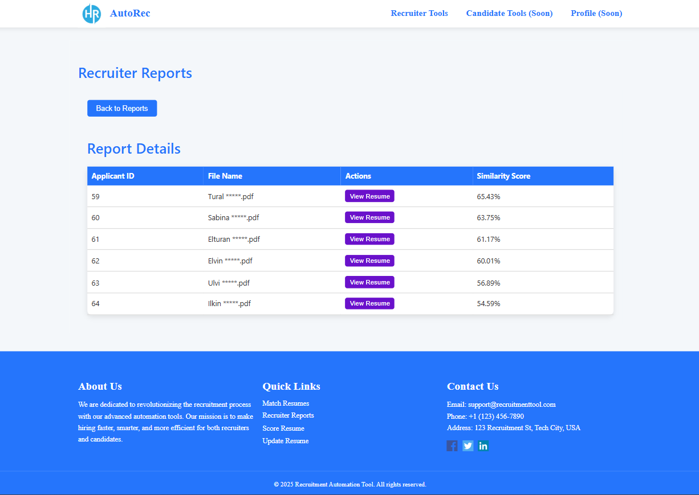
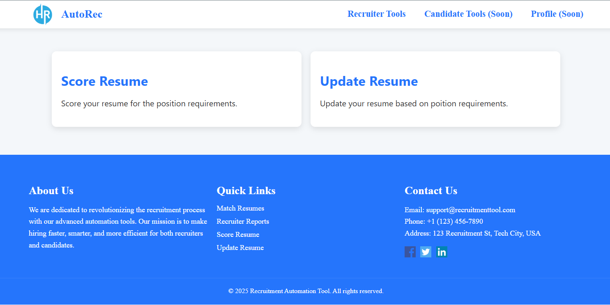
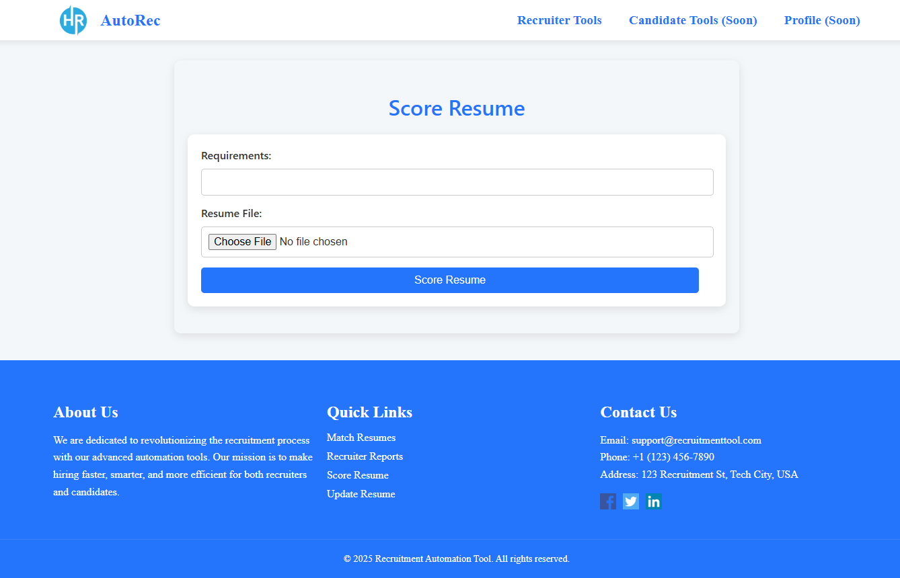
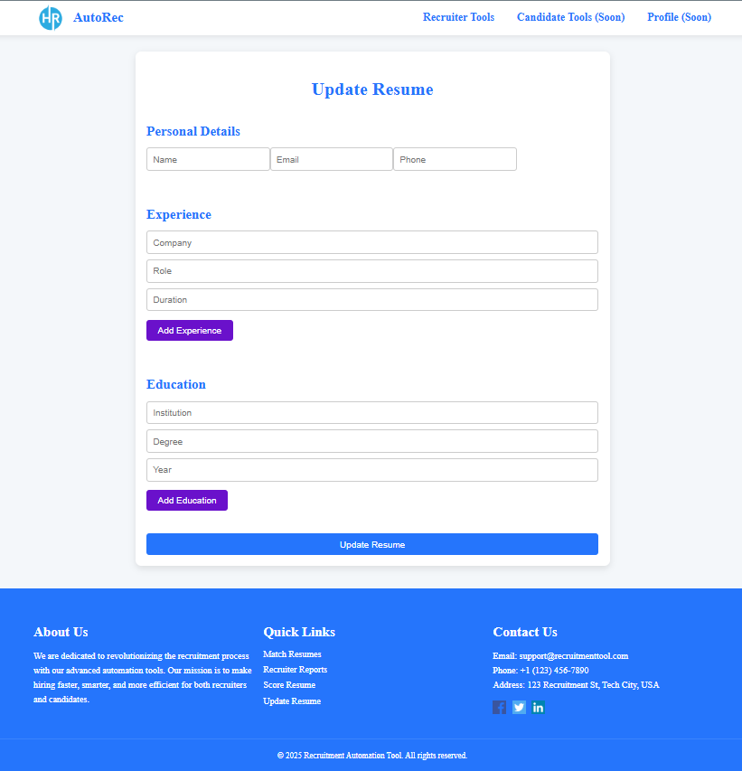

# Recruitment Automation Tool

This project is a comprehensive toolset for automating the recruitment process. It includes a frontend built with React, a report generation service built with Spring Boot, a resume scoring API based on machine learning, and a user service for managing user accounts. Below are the details for each part of the project.

---

## Table of Contents

- [Frontend - Recruitment Automation Tool](#frontend---recruitment-automation-tool)
- [Report Service](#report-service)
- [Resume Scoring API](#resume-scoring-api)
- [User Service](#user-service)
- [Screenshots](#screenshots)
- [Contributing](#contributing)
- [License](#license)

---

## Frontend - Recruitment Automation Tool

This is the frontend application for the **Recruitment Automation Tool**, built using **React** and **Vite**. It provides tools for recruiters and candidates to streamline the hiring process, including generating reports, scoring resumes, and managing user profiles.

### Features

- **Recruiter Tools**:
  - Generate detailed reports by uploading job requirements and resumes.
  - View and manage recruiter reports.
  - Match candidates with job requirements.

- **Candidate Tools**:
  - Score resumes based on job requirements.
  - Update resumes with personal details, experience, and education.

- **User Management**:
  - Sign up and sign-in functionality.
  - Profile management.

- **Responsive Design**:
  - Fully responsive UI for both desktop and mobile devices.

### Installation

1. Clone the repository:
   ```bash
   git clone https://github.com/your-repo/recruitment-automation-tool-frontend.git
   cd recruitment-automation-tool-frontend
   ```

2. Install dependencies:
   ```bash
   npm install
   ```

3. Start the development server:
   ```bash
   npm run dev
   ```

4. Open the application in your browser at `http://localhost:5173`.

### Scripts

- `npm run dev`: Start the development server.
- `npm run build`: Build the application for production.
- `npm run preview`: Preview the production build.
- `npm run lint`: Run ESLint to check for code quality issues.

### Configuration

**API Configuration**:  
Update the `API_URL` constant in the `ReportService.js` file to match your backend server's URL:
```js
const API_URL = "http://localhost:8081/report";
```

**Routing**:  
The application uses **React Router** for navigation. Routes are defined in `App.jsx`:
- `/`: Home page
- `/generate-report`: Generate reports for recruiters
- `/user-reports`: View recruiter reports
- `/sign-in`: Sign in page
- `/sign-up`: Sign up page
- `/score-resume`: Score resumes for candidates
- `/update-resume`: Update resumes for candidates
- `/hr-features`: Recruiter tools
- `/user-features`: Candidate tools

---

## Report Service

The Report Service is a Spring Boot application designed to generate and manage reports based on job requirements and resumes.

### Features

- **Report Generation**: Generates reports by processing job requirements and resumes.
- **Data Storage**: Stores report data and applicant details in a PostgreSQL database.
- **Feign Client Integration**: Uses Feign clients to interact with external services.
- **Swagger Documentation**: Provides API documentation for testing and integration.

### Requirements

- Java 17+
- PostgreSQL

### Installation & Setup

1. Clone the repository:
   ```bash
   git clone https://github.com/your-repo/report-service.git
   cd report-service
   ```

2. Configure the Database by updating `src/main/resources/application.properties`:
   ```ini
   spring.datasource.url=jdbc:postgresql://localhost:5432/reportservice
   spring.datasource.username=your_db_username
   spring.datasource.password=your_db_password
   ```

3. Build the project:
   ```bash
   ./gradlew build
   ```

4. Run the application:
   ```bash
   ./gradlew bootRun
   ```

### API Endpoints

- **Generate Report**: `POST /report/generate`
- **Get Report by User ID and Report ID**: `GET /report/get`
- **Get All Reports by User ID**: `GET /report/get-all-reports`

---

## Resume Scoring API

This API processes job requirement documents and resumes to compute similarity scores, extracts text from various document formats, and uses machine learning to match resumes with job descriptions.

### Features

- **Document Processing**: Supports PDF, DOCX, PNG, JPG, and JPEG formats.
- **OCR for Image-Based Resumes**: Uses Tesseract OCR to extract text from images.
- **Language Detection & Translation**: Detects and translates Azerbaijani, Turkish, and Russian text into English.
- **Semantic Similarity Calculation**: Uses SentenceTransformer to compute resume relevance.

### Installation & Setup

1. Clone the repository:
   ```bash
   git clone https://github.com/your-repo/resume-scoring-api.git
   cd resume-scoring-api
   ```

2. Set up a Python virtual environment and install dependencies:
   ```bash
   python3 -m venv venv
   source venv/bin/activate   # For Linux/macOS
   pip install -r requirements.txt
   ```

3. Run the API:
   ```bash
   python app_with_log_and_matching.py
   ```

### API Endpoints

- **Upload Job Requirements and Resumes**: `POST /upload`
- **Download Processed Files**: `GET /uploads/<filename>`

---

## User Service

The User Service manages users, allowing for registration, retrieval, updating, and deletion of user data.

### Features

- **Register a new user**
- **Retrieve user details by ID**
- **Update user information**
- **Delete a user**

### Installation & Setup

1. Clone the repository:
   ```bash
   git clone https://github.com/your-repo/user-service.git
   cd user-service
   ```

2. Build and run the project:
   ```bash
   ./gradlew clean build
   ./gradlew bootRun
   ```

### API Endpoints

- **Register a User**: `POST /api/user/register`
- **Get User by ID**: `GET /api/user/{id}`
- **Update User**: `PUT /api/user/{id}`
- **Delete User**: `DELETE /api/user/{id}`

---

## Screenshots

Here are some screenshots of the tool in action:


*Caption: The homepage of the Recruitment Automation Tool.*


*Caption: Sign in and sign up section.*


*Caption: Recruiter tools.*


*Caption: Recruiter report generation.*


*Caption: Recruiter tools.*


*Caption: Recruiter reports.*


*Caption: Single report.*


*Caption: Candidate tools.*


*Caption: Candidate report generation.*


*Caption: Candidate resume update.*
---

## Contributing

Contributions are welcome! Please follow these steps:

1. Fork the repository.
2. Create a new branch for your feature or bug fix.
3. Commit your changes and push the branch.
4. Open a pull request.
